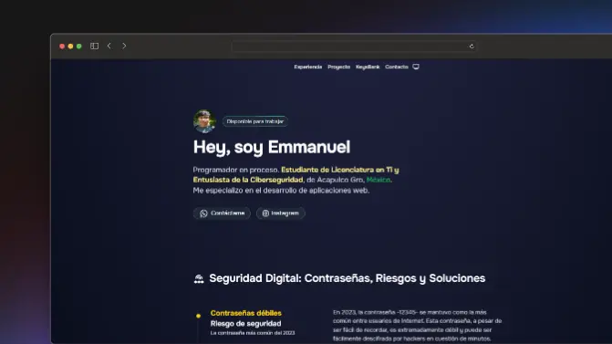

# 👨🏻‍💻 Porfolio para el proyecto KeysBank

"Este repositorio aborda la importancia de la seguridad digital, destacando los riesgos asociados con contraseñas débiles y la reutilización de contraseñas comunes. Explora soluciones prácticas, como el uso de contraseñas complejas, administradores de contraseñas y la autenticación de dos factores, para fortalecer la seguridad en línea."

